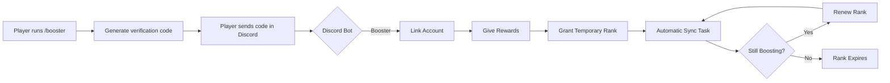

<a id="readme-top"></a>

<div align="center">
  <h1>BoostSync</h1>

  <p><strong>Reward your Discord Nitro boosters in Minecraft — automatically, and only when they're actually boosting.</strong></p>
    </a>

  <p>
    Secure Discord account linking, automatic booster verification, temporary rank synchronization,
    seasonal rewards, and configurable renewals for Spigot and Paper servers.
      </a>
  </p>

  <!-- Modrinth -->
  <p>
    <a href="https://modrinth.com/plugin/boostsync#download">
        </a>
      
    </a>
    <a href="https://modrinth.com/plugin/boostsync/versions">
        </a>
      
    </a>
    <a href="https://modrinth.com/plugin/boostsync">
        </a>
      
    </a>
  </p>

  <!-- GitHub -->
  <p>
    <a href="https://github.com/OkaySleepy/BoostSync/releases">
        </a>
      
    </a>
    <a href="https://github.com/OkaySleepy/BoostSync/releases/latest">
        </a>
      
    </a>
    <a href="https://github.com/OkaySleepy/BoostSync">
        </a>
      
    </a>
  </p>
</div>

---

---

# BoostSync

**Reward your Discord Nitro boosters in Minecraft — automatically, and only when they're actually boosting.**

BoostSync links a player's Minecraft account to their Discord account with a quick one-time code, checks whether they hold your server's Booster role, and hands out rewards plus a temporary in-game rank. From then on it keeps that rank in sync with Discord on its own: keep boosting and the rank keeps renewing, stop boosting and it quietly expires.

**Reward your Discord Nitro boosters in Minecraft --- automatically, and
only when they're actually boosting.**

BoostSync links a player's Minecraft account to their Discord account
with a quick one-time code, checks whether they hold your server's
Booster role, and hands out rewards plus a temporary in-game rank. From
then on it keeps that rank in sync with Discord on its own: keep
boosting and the rank keeps renewing, stop boosting and it quietly
expires.

------------------------------------------------------------------------

## Features

-   **Secure account linking** --- a short one-time code the player
    pastes into a Discord channel, tied to their real Discord account.
-   **Automatic role verification** --- checks your configured Booster
    role directly through the Discord bot.
-   **Temporary booster rank** --- granted on boost and renewed every
    cycle while the player keeps boosting.
-   **Auto-renewal & expiry** --- a background check renews active
    boosters and removes the rank from anyone who stopped.
-   **Once-per-season rewards** --- the one-time bonus can only be
    claimed once per season, even if a player unboosts and reboosts.
-   **Instant manual re-check** --- linked players just run `/booster`
    again to refresh on the spot instead of waiting.
-   **Fully configurable** --- every reward, rank command, cooldown,
    interval, and message lives in `config.yml`.

------------------------------------------------------------------------



------------------------------------------------------------------------

## Commands

  -----------------------------------------------------------------------
  Command                 Description             Permission
  ----------------------- ----------------------- -----------------------
  `/booster`              Verify your boost,      `boostsync.use`
                          claim rewards, and      
                          renew your rank         

  `/boostsync reload`     Reload the              `boostsync.admin`
                          configuration           

  `/boostsync help`       Show the help menu      `boostsync.admin`
  -----------------------------------------------------------------------

Aliases: `/boost`, `/boostreward`.

## Permissions

  Permission                    Description                      Default
  ----------------------------- -------------------------------- ----------
  `boostsync.use`               Use `/booster`                   everyone
  `boostsync.admin`             Full admin access                op
  `boostsync.reload`            Reload the config                op
  `boostsync.bypass`            Skip season limit and cooldown   false
  `boostsync.bypass.cooldown`   Skip only the command cooldown   false
  `boostsync.bypass.onetime`    Claim season rewards again       false

------------------------------------------------------------------------

## Setup

1.  Download BoostSync from Modrinth.
2.  Place the jar into `plugins/`.
3.  Configure your Discord bot.
4.  Configure rewards and rank commands.
5.  Run `/boostsync reload`.

------------------------------------------------------------------------

## Configuration highlights

``` yaml
season: 1

rank:
  duration-days: 7
  check-interval-minutes: 30

rewards:
  commands:
    - "give {player} diamond 64"
```

Placeholders: `{player}`, `{uuid}` in commands --- `{prefix}`,
`{player}`, `{code}`, `{days}` in messages.

------------------------------------------------------------------------

## Support

-   **Developer:** SleepyDN
-   **Email:** sleepyxemail@gmail.com
-   **GitHub:** https://github.com/OkaySleepy
-   **Discord:** @OkaySleepyX
